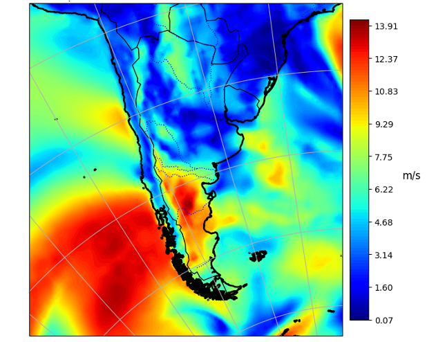

# Renewable Energy Systems Model

These functions are used repeatedly accross many different repositories for my research. I keep them updated, so figured it would be best to keep the repository in one location (rather than repeating the files accross many repositories) such that they can be updated unilaterally. 

## How to use this Repository

First, clone the repository to your local system:
```
git clone https://github.com/cja119/WeatherModel.git
````
Then, install all dependencies by running the following:
```
pip install -r requirements.txt
```
Now you are ready to run the scripts! Set variables of your desired coordinates (lat_1 = minimum latitude, lat_2 = maximum latitude, lon_1 = minimum latitude, lon_2 = maximum latitude)
```
python3 WeatherScripts/GetBothData.py "$lat_1" "$lat_2" "$lon_1" "$lon_2"
```
This will grab the weather data and save it in the WeatherData as a csv file. You can edit more parameters by changing the python files themselves (such as temporal resolution, start and end time, power curves etc.

Running the python scripts 'GetWeatherData.py' will grab the weatherdata files from the NASA Merra-2 database [1]. This is achieved using the [EarthAccess Library](https://earthaccess.readthedocs.io/en/latest/) (N.B., this will require an [EarthData](https://urs.earthdata.nasa.gov/) account, with 'NASA GESDISC DATA ARCHIVE' activated under the applications tab). Once set up, save your username and password as environment variables using the following shell commands:
```
export EARTHDATA_USERNAME="Your_Username"
```

```
export EARTHDATA_PASSWORD="Your_Password"
```
The python file 'ClusterWeatherData.py' can then be used to generate the Culsters using Ward's method [2]. N.B., this will override the default clustered datasets saved in the abovementioned csv files. 

## Weather Data

As abovementioned, this model uses NASA MERRA-2 reanalysis. Data are samlped at a given temporal interval and are linearly interpolated with respect to the latitudnal and logitudnal coordinates, in order to give the weather data for the desired location. A sample of the weather data derived from this model is showed below. 

<p align="center">
  
</p>

## Wind Modelling

The wind farm for this model is a Vestas 3.3 MW turbine, with a slightly extended cutoff speed of 30m/s. The wind speed at the hub height (100m) is modelled using a hellman exponant of 0.15, with the following equaiton:

$$
v(h,v_{H_0}(t)) = v_{H=H_0}(t) \times \left(\frac{H_{hub}}{H_0}\right)^{0.15}
$$

This wind speed is then input into the provided power curve and subsequently interpolated to derive a weather profile:

$$
P_{turb}= f(v(h,v_{H_0}(t)))
$$

For the wind data, due to the long term nature of weather patterns, it is optional to apploy Ward's method of heirarchical clustering by setting the boolean parameter 'cluster' to True when initialising the RenewableEnergy Module. 

## Solar Modelling

For this repository, the solar farm is modelled to be a system using dual axis tilt to track the sun's position. The methodology employed here is based off that described by Pfenninger and Staffel (2016) [3]. In this model, the ratio of diffuse radiation $I_{dif}$ to global irradiation, $I_{glob}$, is estimated using the hourly clearness index and the following logistic function [4]:

$$
k_t = \frac{I_{dif}}{I_{global}}
$$

$$
d = \frac{I_{dif}}{I_{glob}} = \frac{1}{1 + e^{-5.0033 + 8.6025k_t}}
$$

The diffuse and direct plane irradiances are calculated as follows (with a plane incidence angle of $\pi/2$), using the solar azimuth angle $a_s$:

$$
I_{dir,p} = \frac{(1 - d)  I_{glob}}{\cos \left(\frac{\pi}{2} - a_s\right)}
$$

$$
I_{dif,p} =  d \cdot I_{glob} * \frac{(1 + \cos \left(a_s\right)}{2} + \alpha \cdot I_{glob} \cdot \frac{(1 -  \cos \left(a_s\right))}{2}
$$

From here, the equations from Huld et al. (2010) are used to derive the power output from the solar panel [5]:

$$
G' := \frac{G}{G_{\text{STC}}} \quad \text{and} \quad T' := T_{\text{mod}} - T_{\text{mod, STC}}
$$

$$
\eta_{\text{rel}}(G', T') = 1 + k_1 \ln G' + k_2 [\ln G']^2 + T' (k_3 + k_4 \ln G' + k_5 [\ln G']^2) + k_6 T'^2
$$

$$
P(G, T_{\text{mod}}) = P_{\text{STC}} \cdot \frac{G}{G_{\text{STC}}} \cdot \eta_{\text{rel}}(G', T')
$$

With an assumed standard test condition irradiance, $G_{ST}$ of 1000 W/m2, and standard test condition power,  $P_{\text{STC}}$, of 1 MW. $\eta_{\text{rel}}(G', T')$ has been specified to saturate at an upper value of 1. 

## References

[1]: Rienecker, M.M., Suarez, M.J., Gelaro, R., Todling, R., Bacmeister, J., Liu, E., Bosilovich, M.G., Schubert, S.D., Takacs, L., Kim, G.K. and Bloom, S., 2011. MERRA: NASA’s modern-era retrospective analysis for research and applications. Journal of climate, 24(14), pp.3624-3648.

[2]: Jr, J.H.W. (1963). Hierarchical Grouping to Optimize an Objective Function. J Am Stat Assoc 58, 236–244.

[3]: Pfenninger, S. and Staffell, I., 2016. Long-term patterns of European PV output using 30 years of validated hourly reanalysis and satellite data. Energy, 114, pp.1251-1265. Available at: https://doi.org/10.1016/j.energy.2016.08.060

[4]: Ridley, B., Boland, J. and Lauret, P., 2010. Modelling of diffuse solar fraction with multiple predictors. Renewable Energy, 35(2), pp.478-483.

[5]: Huld, T., Gottschalg, R., Beyer, H.G. and Topič, M., 2010. Mapping the performance of PV modules, effects of module type and data averaging. Solar Energy, 84(2), pp.324-338.
