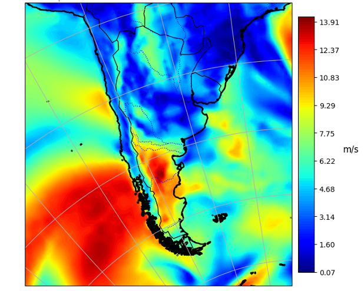

# Quick Start

First, clone the repository to your local system:
```
git clone https://github.com/cja119/meteor_py.git
````
Then, install all the package!
```
pip install -e meteor_py
```
Running the python function 'WeatherData' will grab the weatherdata files from the NASA Merra-2 database [1]. This is achieved using the [EarthAccess Library](https://earthaccess.readthedocs.io/en/latest/) (N.B., this will require an [EarthData](https://urs.earthdata.nasa.gov/) account, with 'NASA GESDISC DATA ARCHIVE' activated under the applications tab). Once set up, save your username and password as environment variables using the following shell commands:
```
export EARTHDATA_USERNAME="Your_Username"

export EARTHDATA_PASSWORD="Your_Password"
```

## Under The Hood [](https://urs.earthdata.nasa.gov/)

As abovementioned, this model uses NASA MERRA-2 reanalysis. Data are samlped at a given temporal interval and are linearly interpolated with respect to the latitudnal and logitudnal coordinates, in order to give the weather data for the desired location. A sample of the weather data derived from this model is showed below. 

<p align="center">
  
</p>
